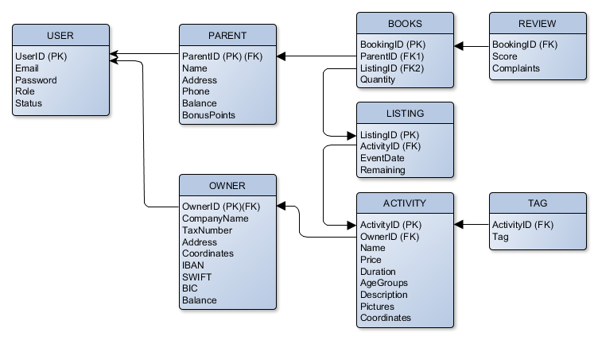

# Software Requirements Specification

### for **goKiddo**

#### 7/1/18 - Version 0.2 prepared by **TeamRocket**

<!-- TOC depthFrom:3 depthTo:6 withLinks:1 updateOnSave:0 orderedList:0 -->

- [1. Introduction](#1-introduction)
	- [1.1	Purpose](#11-purpose)
	- [1.2 Document Conventions](#12-document-conventions)
	- [1.3	Intended Audience and Reading Suggestions](#13-intended-audience-and-reading-suggestions)
	- [1.4 	Product Scope](#14-product-scope)
	- [1.5 	References](#15-references)
- [2. 	Overall Description](#2-overall-description)
	- [2.1 	Product Perspective](#21-product-perspective)
	- [2.2 	Product Functions](#22-product-functions)
	- [2.3 	User Classes and Characteristics](#23-user-classes-and-characteristics)
	- [2.4 	Operating Environment](#24-operating-environment)
	- [2.5 	Design and Implementation Constraints](#25-design-and-implementation-constraints)
	- [2.6 	User Documentation](#26-user-documentation)
	- [2.7 	Assumptions and Dependencies](#27-assumptions-and-dependencies)
- [3. 	External Interface Requirements](#3-external-interface-requirements)
	- [3.1 	User Interfaces](#31-user-interfaces)
	- [3.2 	Hardware Interfaces](#32-hardware-interfaces)
	- [3.3 	Software Interfaces](#33-software-interfaces)
		- [3.3.1 Auth service](#331-auth-service)
		- [3.3.2 Database](#332-database)
		- [3.3.3 Media service](#333-media-service)
		- [3.3.4 Main service](#334-main-service)
		- [3.3.5 API gateway](#335-api-gateway)
	- [3.4 	Communications Interfaces](#34-communications-interfaces)
- [4. 	System Features](#4-system-features)
	- [4.1 User authentication](#41-user-authentication)
		- [4.1.1 Description](#411-description)
		- [4.1.2 Stimulus/Response sequence](#412-stimulusresponse-sequence)
	- [4.2 Activity search](#42-activity-search)
	- [4.3 Activity booking](#43-activity-booking)
	- [4.4 Venue registration](#44-venue-registration)
	- [4.5 Activity registration](#45-activity-registration)
	- [4.6 System administration](#46-system-administration)
- [5. 	Other Nonfunctional Requirements](#5-other-nonfunctional-requirements)
	- [5.1     Performance Requirements](#51-performance-requirements)
	- [5.2 	Safety Requirements](#52-safety-requirements)
	- [5.3 	Security Requirements](#53-security-requirements)
	- [5.4 	Software Quality Attributes](#54-software-quality-attributes)
	- [5.5 	Business Rules](#55-business-rules)
		- [5.5.1 Digital wallet](#551-digital-wallet)
		- [5.5.1 Ticket policy](#551-ticket-policy)
		- [5.5.1 Revenue model](#551-revenue-model)
- [6. 	Other Requirements](#6-other-requirements)
- [Appendix A: Glossary](#appendix-a-glossary)
- [Appendix B: Analysis Models](#appendix-b-analysis-models)
- [Appendix C: To Be Determined List](#appendix-c-to-be-determined-list)

<!-- /TOC -->

### 1.	 Introduction

#### 1.1	Purpose
We aim to create a simple, effective and comprehensive booking system that helps
parents book activities for their kids.

#### 1.2 	Document Conventions

#### 1.3	Intended Audience and Reading Suggestions
The intended audience of the current document are:
- the developers of this project
- third-parties associated with the production process
- potential investors
- technical reviewers tasked with assessing the state of the project (along with
  their grannies).

#### 1.4 	Product Scope
GoKiddo is a web application that enables parents to effortlessly book
activities for their kids. It aims to deliver a responsive interface for parents
to navigate their numerous options by offering multiple search filters,
including geospatial filters, all from the comfort of a single page on their
phone, tablet or personal computer.

For venue owners, GoKiddo present an attractive way of supplying key
information about the offered activities and the ability of self-promotion, in
order to reach a wider audience. GoKiddo also tracks event income statistics
on a monthly basis, providing suppliers with critical insights for evaluating
their events.  

#### 1.5 	References

### 2.		Overall Description

#### 2.1 	Product Perspective
The application is a web-based system implementing the client-server model. It
offers the following features:

- Cross-platform support: The application is compatible with any connected
  device equipped with an Internet connection and a modern browser. Special care
  is taken to ensure optimal user experience on any device type.
- User account: The system allows the user to create and manage an account and
  also manage a digital wallet.
- Search: The user can search for activities of their liking using various
  filters, including filters of geospatial nature.
- Booking system: The user can book activities using a digital currency
  associated with our digital wallet.
- Fine-grained statistics: Our system keeps track of all transactions and
  presents them to the venue owners in a useful way.

#### 2.2 	Product Functions
Our product promises to deliver the following functionality, sorted by user
class:

**Guest user**
- Query activities using various filters (category, distance, price)
- Register as a Parent or Venue owner

**Parent**
- Manage a digital wallet
- Book activities using our digital currency
- Query activities using various filters (category, distance, price)
- Mark activities as favorite
- Access a calendar overview of future and past activities
- Review activities

**Venue owner**
- Register service details
- Manage a wallet dashboard
- Get an overview of general and per-event income statistics
- Define pricing policy

**Administrator**
- Grant and revoke user privileges
- Permanently ban users
- Reset user password

#### 2.3 	User Classes and Characteristics
As mentioned above, we identify the following user classes, based on the product
functions they use:

- Guest user
- Parent
- Venue owner
- Administrator

#### 2.4 	Operating Environment
The application is designed to be hosted in a cloud server, running
Ubuntu 16.04 LTS and **requires** that `docker` and `docker-compose` libraries
are installed.

#### 2.5 	Design and Implementation Constraints
We have identified the following design and implementation constraints:

- The application requires an Internet connection to function properly, as then
  acts of event search, booking, profile management and administration need a
  steady communication of data between a web client and the application server.
- The user interface must be responsive, in order to ensure optimal user
  experience in a wide range of devices.
- Network usage must be efficient via code minification and the gzipping of
  transmitted data.
- User passwords and stored credit card details must be encrypted.
- User activity must be securely communicated over an HTTPS channel, using a
  self-signed certificate.
- The application must implement a RESTful API, in order to enhance
  maintainability and extensibility.

#### 2.6 	User Documentation
None at the moment, as it is considered beyond the scope of this implementation.

#### 2.7 	Assumptions and Dependencies
We assume that all electronic payments are simulated, in the sense that
**no real** money is transferred to and from a digital wallet.

There is a binary dependency on a separate module, tasked with processing images
submitted by the users, in order to add a watermark and optimize the image size.
The details of this module will be specified in later revisions.

There is also a dependency on a third-party online map service, to be specified
in later revisions.

We also assume that all client devices are of sufficient computational power, in
order to run the application as is. We cannot guarantee proper user experience
on outdated devices.

### 3.		External Interface Requirements

#### 3.1 	User Interfaces
When visiting the application website without credentials (guest), the user can
search for activities, perform refined queries and view their details. Once
action for booking is taken, the guest user is prompted to `log in` or
`sign up` to proceed.

Once logged in, the user must choose the number of tickets and the date of the
event. Upon choosing, the order confirmation is displayed and the user can
initiate payment. Upon success, the user receives a printable `.pdf` copy of the
invoice and returns to the home page. In case of insufficient funds, the user
can choose to top up their digital wallet.

The `User settings` menu provides access to the digital wallet overview,
including top up options, purchase history and a calendar view of all past and
future events the user has booked.

Upon completion of an activity, the user will receive an e-mail, with a link
leading to the review page for the current activity. Once there, the user can
rate the activity on a 5-star rating system and can also leave a text
description of their experience. To ensure that the user can freely express
their opinions, we include an option to make the review anonymous.

If the user opts to register as an activity venue, they must fill in:
- the basic venue details
- the venue address (with the ability to verify it by viewing the map)
- the details for the bank account, where the monthly payments are to be
  deposited.

Upon successful registration, the venue owner is transferred to the venue
dashboard. The user can then get a calendar view of all planned activities,
check cumulative and per-event income statistics and edit/create events.

The admin user must use a separate link to access the admin page of our
application. The login credentials are supplied by us.

Once logged in, the admin user can add, edit and delete any entity of our
application. The admin user can also view a comprehensive transaction history.

> The admin page is designed for desktop use only.

#### 3.2 	Hardware Interfaces
The application does not include the use of any designated hardware.

> Optional:
>
> In future iterations of the product, special hardware leased to select venue
> owners could be used to automate the participation tracking of each event.

#### 3.3 	Software Interfaces
We aim to build the application on multiple microservices. The communication
between each microservice is designed in a RESTful manner, to improve design
consistency and maintainability.

The architecture is detailed below:

##### 3.3.1		Auth service
A `node.js` implementation of the [OAuth2](https://oauth.net/2/) protocol using
[JSON Web Tokens](https://jwt.io/). To accomplish this, the service utilizes the
`simple-OAuth2` node module to generate and maintain an authentication token once
the user is logged in and use it to determine if any privileged data should be
served.

##### 3.3.2		Database
We opt for a relational database, since our data model is rather aligned with
its advantages. The specific implementation we chose is `PostgreSQL`, along with
its `PostGIS` extension, that offers geospatial functionality.

An initial version of the database schema is presented below:

##### 3.3.3		Media service
As described in the exercise requirements, we must implement a separate services
tasked with applying a watermark to all submitted venue images. The proposed
service runs on `node.js` and utilizes node module `image-watermark` to apply
the watermark to a submitted image and then return it to be stored in our main
server.

##### 3.3.4		Main service
Our main service is written in `node.js` to handle user requests and distribute
them to the corresponding services. It uses the `node-postgre` driver to
communicate with the Database.

##### 3.3.5 	API gateway
We aim to create a single access point for calls to our application. To this end
we will design a simple Nginx server to handle all incoming load.

The Nginx service is also set to implement communication encryption via a
self-signed certificate.

We opted for this additional `nginx` layer to reduce the load on the `node.js`
main service.

#### 3.4 	Communications Interfaces
The current document refrains from providing details on inter-system
communication, as it is utilized by either the operating system or the
conventional internet transfer protocols.

### 4. 	System Features
This section includes the requirements that specify the fundamental actions of the software system.

#### 4.1 	User authentication
First and foremost, the system provides user authentication for the verification of an active human-to-machine transfer of credentials required for confirmation of the user’s authenticity.

##### 4.1.1	Description
As noted, the authentication is executed through a `node.js` implementation of the [OAuth2](https://oauth.net/2/) protocol using [JSON Web Tokens](https://jwt.io/).

Once the user is logged into the service, an authentication token is generated through the `simple-OAth2`node module to be used for determining if any privileged data should be served.

##### 4.1.2 Stimulus/Response sequence
The stimulus/Response sequencing for the authorization is thoroughly explained in the diagrams below.

For public resources, such as browsing activities, where no privileged data is requested, the sequence is executed as follows:

For private resources, such as booking activities for parents or registering venues for owners, where privileged data is requested, the sequence is executed as follows:

#### 4.2	Activity search

#### 4.2.1 	Description
Either logged in or as a guest, the user is be able to search for activities and browse them.

##### 4.2.2 Stimulus/Response sequence
The user first searches for activities in the search box. The browser then requests, receives and shows matching activities.

The user can browse through the activities given and is given the option of adding the following filters to help find preferred activities:
- price
- distance
- tags

The user can then select preferred activity. The browser requests, receives and displays the requested activity information.

The user is provided with the following:  
- address of the activity venue with geospatial mapping
- sample pictures
- rating
- reviews
- booking option

When logged in as a parent, the user is given the option to book selected activities.

If the user is not already logged in, they are transferred to a new page
in which they are prompted to log in or register.

#### 4.3 	Activity booking

#### 4.3.1 	Description
After pressing book, the user is transferred to a page, where he is given the following:
- an illustration of the available dates on a calendar, in which he is to select date and time
- number of remaining available tickets
- number of tickets to book

Upon choosing, the order confirmation is displayed and the user can initiate payment.

Upon success, the user receives a printable `.pdf` copy of the invoice to his email address and returns to the home page.

In case of insufficient funds, the user is transferred to an error page and is asked to Top up their digital wallet (more details on currency management), or cancel payment and return.

After the final date of the booked activity has passed, an automatic e-mail is send to the user's e-mail address, with a link leading to the review page of the booked activity.

There, they are given the following:
- Rating (5 star scale) & writing a review on the activity  
- Option for review being anonymous

##### 4.3.2 Stimulus/Response sequence
The search/booking sequence is executed as follows:

#### 4.4	Currency management

#### 4.4.1	Description
When logged in, the user has access to a digital wallet, which is requested either manually or when booking an activity, in case of insufficient funds.

In the digital wallet page, the user can view
- Current balance  
- Detailed transaction history
- Top up  button

When pressing `Top up`, the user is transferred to another page in which they are given their current balance, and can select the top up amount, which is displayed together with the price in Euros.

More information on the digital wallet, in paragraph 5.5.1

#### 4.4.2 Stimulus/Response sequence
The sequence is briefly explained in the following diagram:

#### 4.5	Venue and activity registration

#### 4.5.1 	Venue registration

#### 4.5.1.1 Description
 When registering as an activity venue, the following details are filled:
- E-mail
- Company name
- Tax registration Number
- Picture(s) of the venue
- City
- Postal code
- Venue address (geospatial verification)
- Payment details for monthly payments, executed according to our business plan

#### 4.5.2	Activity registration

#### 4.5.2.1	Description
After a venue is registered, activity registrations on the registered venue are possible.

The venue owner is transferred to the venue dashboard, consisting of:

- Add event option.
- A calendar view of all planned activities  
- Cumulative and per-event income statistics

Pressing add event transfers the owner to a new page where they are prompted to fill in the following Event Details:
- Event Name
- Age Groups
- Descriptions

Then, they are to select price of ticket and activity capacity.

The owner is given the option to add tags to the event and upload pictures of the activity venue.

Pressing `Set dates`, transfers the owner to a new page consisting of a calendar, where they are to set dates for the event.

Upon completion, they are directed back to the dashboard.

#### 4.5.3 Stimulus/Response sequence
The stimulus/response sequence applied when registering a venue and creating activities on that venue, is briefly explained in the diagram below:

#### 4.6	System administration

#### 4.6.1 	Description
An admin user logs in from a separate link accessing the admin page of the application.

The admin is then transferred to a page listing all the application entities.

Each entity is listed along with their ID, name and status.

The admin is provided with the following options:

- Add entity
- Edit entity
- Delete entity
- View  application transaction history

#### 4.6.2	Stimulus/Response sequence
The system administration sequence is executed as follows:

### 5. 	Other Nonfunctional Requirements

#### 5.1	Performance Requirements

#### 5.2 	Safety Requirements

#### 5.3 	Security Requirements
As the application deals with sensitive personal data, we ensure privacy
protection by implementing
- an encrypted website
- token based authentication
- encrypted data storage

#### 5.4 	Software Quality Attributes

#### 5.5 	Business Rules

##### 5.5.1	Digital wallet
We only grant a digital wallet to registered users.

Any user with a digital wallet can top up their points via credit card.

> Note:
>
> In the scope of this implementation, money transfers are ALWAYS successful,
> without triggering any actual transfer.

We set the exchange rate to be `1 euro = 10 coins`. Top-up requires password
re-entry, to ensure that it is properly authorized.

For every booking, `Bonus Points` are added to the parent's digital wallet.
The Bonus Points can then be used to get free items from a sponsored product
list.

##### 5.5.1 Ticket policy
Every ticket is uniquely identified by its `ticketID`. Upon successful purchase,
a pdf copy of the ticket is sent via e-mail to the user.

In the scope of this implementation, tickets are considered non-refundable.

##### 5.5.1 Revenue model
Our revenue model initially identifies a single basic revenue stream:
- 10% commission on every ticket sale

> Potential revenue sources include:
>
> 1. Promotion fees for venue owners
> 2. Advertisement fees for affiliated companies

### 6. 	Other Requirements

### Appendix A: Glossary

### Appendix B: Analysis Models

### Appendix C: To Be Determined List
- Determine Appendix C
